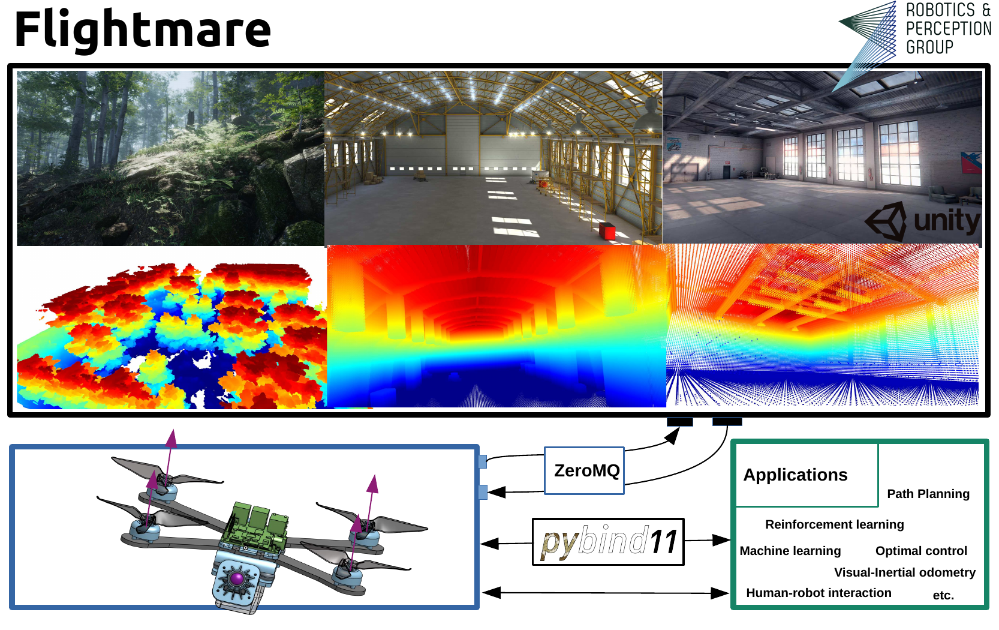

# Flightmare

 

We present a new modular quadrotor simulator: Flightmare.
Flightmare is composed of two main components: a configurable rendering engine built on Unity and a flexible physics engine for dynamics simulation.
Those two components are totally decoupled and can run independently from each other. 
Flightmare comes with several desirable features: (i) a large multi-modal sensor suite, including an interface to extract the 3D point-cloud of the scene; (ii) an API for reinforcement learning which can simulate hundreds of quadrotors in parallel; and (iii) an integration with a virtual-reality headset for interaction with the simulated environment.
We demonstrate t:he flexibility of Flightmare by using it for two completely different robotic tasks: learning a sensorimotor control policy for a quadrotor and path-planning in a complex 3D environment.

# Development Progress

* flighlib
* flightros 
* flightrl
* flightrender
* flightdoc
  
