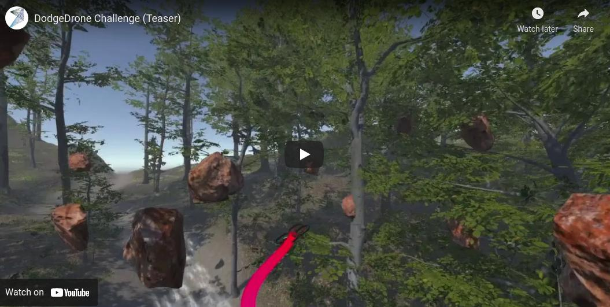

# DodgeDrone Challenge


## Motivation

The DodgeDrone challenge revisits the popular <a href="https://en.wikipedia.org/wiki/Dodgeball">dodgeball</a> game in the context of autonomous drones. Specifically, participants will have to develop navigation algorithms to fly drones between waypoints while avoiding dynamic obstacles. Drones are fast but fragile systems: as soon as something hits them, they will crash!
Since objects will move towards the drone with different speeds and acceleration, smart algorithms are required to avoid them!

Please check out the [workshop website](https://uzh-rpg.github.io/PADE-ICRA2021/ddc/) for details about the challenge and the evaluation. 

[](https://www.youtube.com/watch?v=ZC1jfh2074o)


## Instructions

These instructions will guide you to build the training and validation environment.
The training environment is a box filled with obstacles of convex shape, while the testing environment is a forest.
In the forest, the drones will have to avoid rocks and adversarial birds. Note that the simple environment enables large-scale training of reinforcement learning agents, while the forest is significantly slower in rendering and not suited to large-scale training (even though nothing stops you to do that!).

The competition code is released as a docker image based on the [nvidia/cuda:10.2-runtime-ubuntu18.04](https://hub.docker.com/layers/nvidia/cuda/10.2-runtime-ubuntu18.04/images/sha256-47075294e9a714464353634c32e4d4fab0fd64b926c035d70761b837383c25a4?context=explore)
docker with some added dependencies and a Miniconda installation.


## Install

First, [Install Docker Engine on Ubuntu](https://docs.docker.com/engine/install/ubuntu/). Then, please follow these steps:

1. Open a new terminal and download the Docker image with:
   
   `docker pull uzhrpg/dodgedrone-challenge:base`

2. Fork this [Flightmare](git@github.com:uzh-rpg/flightmare.git) repository on your Github account.

3. Create a folder on your PC and clone your Flightmare repository in it (don't forget to add your account):
   
   `mkdir dodge_drone_challenge && cd dodge_drone_challenge`
   
   `git clone git@github.com:YOUR-GITHUB-ACCOUNT/flightmare.git`

   `cd flightmare && git checkout ddc_challenge`

   Before continuing, be sure to be on the right Flightmare branch!

4. In a new terminal, run the container with(remember to change the `path_to_dodge_drone_challenge_folder`!)
   
   `docker run -it -v path_to_dodge_drone_challenge_folder:/root/challenge/ --rm --runtime=nvidia -e NVIDIA_VISIBLE_DEVICES=all  -p 10253:10253 -p 10254:10254 --name ddc-challenge uzhrpg/dodgedrone-challenge:base /bin/bash`
   
   Breakdown of the command:
   
   * `-v path_to_dodge_drone_challenge_folder:/root/challenge/` mount the `path_to_dodge_drone_challenge_folder` on your local PC to `/root/challenge/` inside the container. Doing that you can use an IDE or text editor directly on the code inside dodge_drone_challenge/flightmare and the container will see the modified code. 
   
   * `-p 10253:10253 -p 10254:10254` port used for communicating with Unity standalone.
   
   * `uzhrpg/dodgedrone-challenge:base` name of the image and tag
   
   * `/bin/bash` run a bash terminal in the container once is created

    Now you can navigate inside the container as it was on a normal Ubuntu machine.  
    If you wish to open another terminal connected to the container use: `docker exec -it ddc-challenge bash`.

5. In this terminal, follow the instructions that you can find here [uzh-rpg/flightmare Wiki](https://github.com/uzh-rpg/flightmare/wiki/Install-with-pip) to install flightmare and its dependencies. The apt dependencies are already installed. For example, if you want to use anaconda, please use these commands:
   1. `conda create --name RL python=3.6`
   2. `conda activate RL`
   3. `conda install pytorch==1.7.1 torchvision==0.8.2 torchaudio==0.7.2 -c pytorch`
   4. `cd flightmare/flightlib && pip install .`
   5. `pip install stable-baselines3`

    A FLIGHTMARE_PATH environment variable has already been added in the .bashrc pointing to  `/root/challenge/flightmare` , in case you choose different names in the process please change accordingly.

6. A Docker container state is volatile so once you create your environment you can save the status of the container using this workflow:
   
   `docker ps` to see the Docker containers  that are running
   
   `docker commit CONTAINER_ID name-you-want-to-give:tag-you-want-to-give`
   
   The next time you want to run the container change the name of the image in the `docker run` command to the new name and tag you choose.

6. The Unity standalone will be running on your PC and will communicate with Flightmare using the port mentioned above. You can download the standalone [here](http://rpg.ifi.uzh.ch/challenges/DodgeDrone2021/Standalone_Forest.zip). When downloaded and unzip, in a terminal in your computer (not in docker!) run the following command:

   `./STANDALONE_PATH/RPG_Flightmare.x86_64 -static-obstacles 0`

   If you do not need to visualize what the drone is doing add the option `-batchmode` after the command for a faster simulation. In the standalone you will find two environments built in. The first is a box environment, which is very small and lightweight. You should reserve this for training and developing your algorithms (it can run up to 700 fps on a common desktop). The second is a more complex forest environment, which is significantly slower. You might want to reserve this testing, but feel free to also train with it if you wish! You can switch between environments by changing [this flag](https://github.com/uzh-rpg/flightmare/blob/ddc_challenge/flightlib/configs/vec_env.yaml#L3).
   For everybody with a small GPU and limited computational power, we also prepared a standalone which only contains the box environment (in that case the previous flag will not have any effects). This standalone is faster to download and to execute. You can download this standalone [here](http://rpg.ifi.uzh.ch/challenges/DodgeDrone2021/Standalone_Simple.zip).

7. In a terminal with docker, run the following command:

   `cd $FLIGHTMARE_PATH/flightrl/examples && python test_vec_env.py`

   If everything is installed correctly, you will see the drone hovering in place.

## Train & Evaluate

We have added some auxiliary code to help you start with the challenge using reinforcement learning. However, if you want to use something else, feel free to make all the changes you need. Just be sure that everything works fine when you submit!

1. In a terminal (not within docker), launch the unity standalone. The flag controls if you want to train/test on static or dynamic environments (the following will launch with dynamic obstacles):

  `./STANDALONE_PATH/RPG_Flightmare.x86_64 -static-obstacles 0`

2. In a terminal within Docker, run the following command:

   `cd $FLIGHTMARE_PATH/flightrl/examples && python run_drone_control.py`

   This script will launch a reinforcement learning training with PPO. Note that this model will not see any images, so it won't be able to solve the task.

3. To evaluate the trained checkpoint (assuming its path is contained in the variable $MODEL_PATH), run the following command:

   `cd $FLIGHTMARE_PATH/flightrl/examples && python run_drone_control.py --train 0 --weight $MODEL_PATH`

4. The final evaluation, which will be the one you will be ranked with, can be run with the command 
   
   `cd $FLIGHTMARE_PATH/flightrl/rpg_baselines/evaluation && python evaluation.py`

   To run this evaluation, you will have to adapt the definition of your agent in the file [obstacle\_avoidance\_agent.py](https://github.com/uzh-rpg/flightmare/blob/ddc_challenge/flightrl/rpg_baselines/evaluation/obstacle_avoidance_agent.py). In particular, you will have to adapt the function `getActions` to generate control commands according to your policy.
   
In the provided example, you will not be able to directly access the images from the wrapper step function, so you won't be able to solve the task by directly train using stable baselines. To enable access to images during training the function [get_images](https://github.com/uzh-rpg/flightmare/blob/bdaffdfdb56396be34844121397aac80e80141d9/flightrl/rpg_baselines/envs/vec_env_wrapper.py#L84) is already available.

However, note that if you want to keep using this training code and pass both images and the drone's state, you will have to make some changes to the training algorithms. There are multiple ways to do it, and you can choose the one you prefer. We recommend the following:

1. Clone the [stable-baselines code](https://github.com/DLR-RM/stable-baselines3).
2. Adapt the functions [train](https://github.com/DLR-RM/stable-baselines3/blob/master/stable_baselines3/ppo/ppo.py#L159), [collect_rollouts](https://github.com/DLR-RM/stable-baselines3/blob/master/stable_baselines3/common/on_policy_algorithm.py#L126), and [learn](https://github.com/DLR-RM/stable-baselines3/blob/master/stable_baselines3/common/on_policy_algorithm.py#L205) to make the observation space a tuple of images and state instead of list.
3. Adapt the training code to use this local version of stable-baselines.

Please note that this is not the best but just one of the many possible solutions, and you can choose the one you prefer!

## Submission

The submission will be in the form of a Docker image with everything it needs to run inside it (the Unity standalone is excluded).  You will need to push the aforementioned image to Dockerhub so be sure to create an account and a repository to which you can push. Please adopt the following repository and tag naming: `you-dockerhub-account/dodgedrone-challenge:submission-"your-surname"-"your-name"`.

Before the submission please be sure to have built your code and that everything works, then copy your code and <u>everything else you might need</u> in the container home directory.

For example:

`cd path_to_dodge_drone_challenge_folder && cp ./flightmare ./../`  if you have used the folder conventions above. 

Then commit the changes:

`docker commit CONTAINER_ID you-dockerhub-account/dodgedrone-challenge:submission-"your-surname"-"your-name"`

`docker push you-dockerhub-account/dodgedrone-challenge::submission-"your-surname"-"your-name"`

After that include in the ReadMe all instructions and commands that need to be used in order to start the evaluation on your code.
To submit, add uzhrpg as a collaborator (it is recommended to keep the repository private) and send an email to loquercio@ifi.uzh.ch with subject <u>dodgedrone submission</u>.

We will evaluate submissions in both static and dynamic environments by keeping their structure unchanged but running it with a different random seed.
There are three dates to submit: 10th of April, 10th of May, and 1st of June. While the first two are optional and only for you to test, the last one will be used to grade the submissions.
The submission which will achieve the highest score in the forest with dynamic obstacles will win a [Skydio2](https://skydio.com/skydio-2)!

## Issues

For any problem in running the simulator or making a submission, please open an issue in this repository by explicitily mentioning that the problem is related to the challenge. In addition, please send an email to the organizers to make sure we do not lose track of any issue.

## Publication

If you use this code in a publication, please cite the following paper **[PDF](http://rpg.ifi.uzh.ch/docs/CoRL20_Yunlong.pdf)**

```
@article{song2020flightmare,
    title={Flightmare: A Flexible Quadrotor Simulator},
    author={Song, Yunlong and Naji, Selim and Kaufmann, Elia and Loquercio, Antonio and Scaramuzza, Davide},
    booktitle={Conference on Robot Learning},
    year={2020}
}
```
