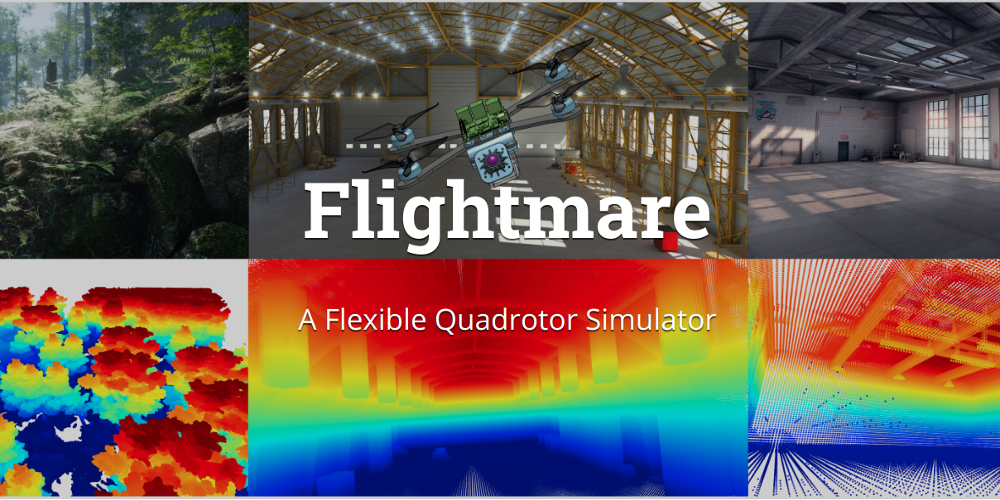

# Flightmare - 左青龙

 
 

**Flightmare** is a flexible modular quadrotor simulator.
Flightmare is composed of two main components: a configurable rendering engine built on Unity and a flexible physics engine for dynamics simulation.
Those two components are totally decoupled and can run independently from each other. 
Flightmare comes with several desirable features: (i) a large multi-modal sensor suite, including an interface to extract the 3D point-cloud of the scene; (ii) an API for reinforcement learning which can simulate hundreds of quadrotors in parallel; and (iii) an integration with a virtual-reality headset for interaction with the simulated environment.
Flightmare can be used for various applications, including path-planning, reinforcement learning, visual-inertial odometry, deep learning, human-robot interaction, etc.

**[Website](https://uzh-rpg.github.io/flightmare/)** & 
**[Documentation](https://flightmare.readthedocs.io/)** 

[](https://youtu.be/m9Mx1BCNGFU)

## Installation
Installation instructions can be found in our [Wiki](https://github.com/uzh-rpg/flightmare/wiki).
  
## Updates
 *  17.11.2020 [Spotlight](https://youtu.be/8JyrjPLt8wo) Talk at CoRL 2020 
 *  04.09.2020 Release Flightmare

## Publication

If you use this code in a publication, please cite the following paper **[PDF](http://rpg.ifi.uzh.ch/docs/CoRL20_Yunlong.pdf)**

```
@inproceedings{song2020flightmare,
    title={Flightmare: A Flexible Quadrotor Simulator},
    author={Song, Yunlong and Naji, Selim and Kaufmann, Elia and Loquercio, Antonio and Scaramuzza, Davide},
    booktitle={Conference on Robot Learning},
    year={2020}
}
```

## License
This project is released under the MIT License. Please review the [License file](LICENSE) for more details.
