.. _standalone-build:

Standalone build — Make the build in Unity
==========================================

Install Unity and import project
--------------------------------

This is a Unity Project that built with Unity Editor Unity 2020.1.10, thus, it requires a Unity Editor installed. 
An earlier version might also work, but you have to downgrade the project and might loss some Unity features, or maybe not.

Prerequisites
^^^^^^^^^^^^^

- 1) Install `Unity Hub 2.0 for Linux(recommended), or Windows/MacOS <https://forum.unity.com/threads/unity-hub-v2-0-0-release.677485/>`_. 
    
  - To run Unity Hub, make the downloaded file executable first: `chmod +x UnityHub.AppImage`

- 2) Install Unity Editor (>= Unity 2020.1.10) via the Unity Hub. 

  - Launch **Unity Hub**
  - Find **Installs** 
  - Click **add** and select a **version** of unity 
  - Click **NEXT**     
  - Select **Linux Build Support** if you are using the Hub in a Windows or MacOS => DONE.

Get the project
^^^^^^^^^^^^^^^

.. code-block:: bash

  # Clone the unity project to the local computer
  git clone git@github.com:uzh-rpg/rpg_flightmare_unity.git

Introduction to Unity
^^^^^^^^^^^^^^^^^^^^^
If you're not familiar with the basics of Unity yet, then check out the `Unity Tutorials <https://learn.unity.com/>`_.

Building Linux Standalone
-------------------------

Compiling the Unity application to Linux (or Windows/MacOS) standalone is straightforward. 
On your Unity Editor, click **File** -> **Build Settings** -> **Build**. 
But please make sure the following settings in case of unexpected errors:

- **Target platform** = Linux/Windows/MacOS
- **Scenes in Build** = {Top_Level_Scene - 0, Warehouse/Scenes/DemoScene - 1}
- **Fullscreen Mode** = Windowed
- **Color Space** = Linear 

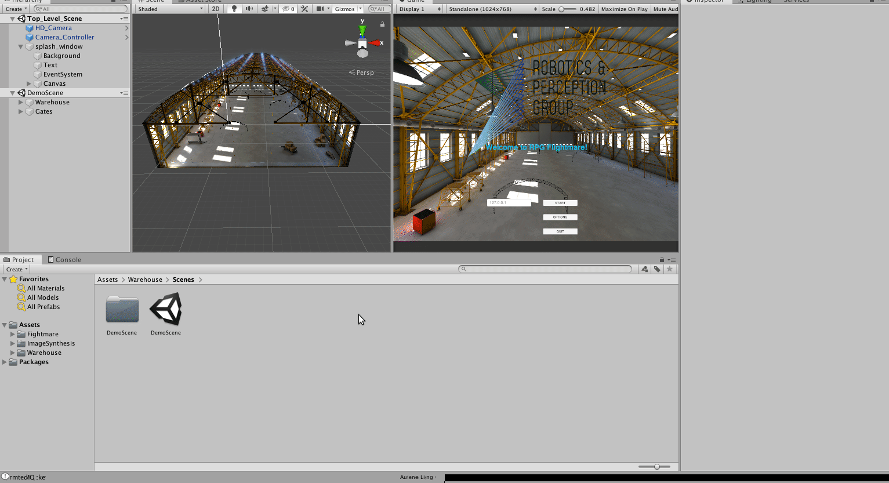

.. note:: 
  Ignore the HDRP warning (*Build time will be extremely long*) when clicking **Build** button, it will take a while (not more than 2 minutes) for building the application for the first time, and become fast (around 10 seconds) after the first build.

Editing Unity Project
---------------------

The first time you load the project, Unity will create an empty scene which we don't need, delete it.
Load the **Top_Level_Scene** that has three basic **GameObjects**,

- **HD_Camera**: the main camera that renders images
- **Camera_Controller**: the main controller for loading different scenes, moving the camera, and retrieving camera pose & publishing images. 
- **splash_window**: the UI interface. 

.. image:: ../_images/_standalone/editproject.gif
  :alt: Edit Unity Project
  :align: center

Afterward, load a warehouse scene for demo. 
Move the **Game** window to the right so you can visualize both the 3D model on the left and the camera view on the right. 
Click **Play** to build and run the program. 
The application creates two TCP sockets, one for publishing images and one for subscribing camera pose. 
Clicking the **Start** button will start the program, but since we don't have a client running and sending messages to the server, you won't see any changes. 

Adding objects to scene during runtime
^^^^^^^^^^^^^^^^^^^^^^^^^^^^^^^^^^^^^^

On the Unity side, add a prefab of your object in the folder Assets/Resources/<prefab_id>. 

On the ROS side inherit from **static_object** in flightlib/objects. For references check out static_gate. 

.. _add-scene:

Add a scene to the standalone
^^^^^^^^^^^^^^^^^^^^^^^^^^^^^

Follow the step-by-step instructions to properly add your scene to Flightmare.

Create or add a new scene
"""""""""""""""""""""""""

First, you need a new scene. You can add your scenes or scenes from the asset store.

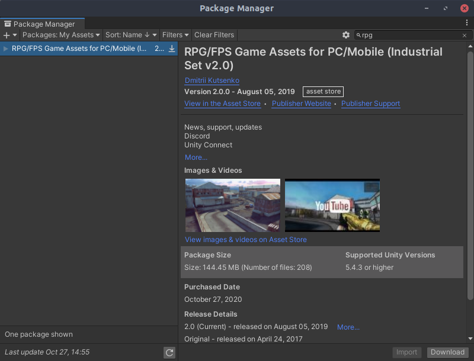

Move the scene into the folder Environments
"""""""""""""""""""""""""""""""""""""""""""

To have a consistent project structure, we move all scenes into the environment folder.
The structure then is *Environments/<Project Name>/*. 
Within this folder, we have usually a scenes folder *Environments/<Project_Name>/Scenes/<Scene>* with all scenes. 
Everything else is project-depended. 

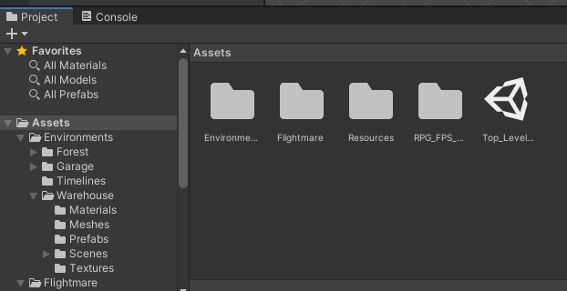

Add the scene to the sceneSchedule
""""""""""""""""""""""""""""""""""

Next, we add the scene to the sceneSchedule. 
We have to add the path to the scene to the scenes_list.
(Optional) For the UI we need to add the function load<Scene>() which will be added later to the button.

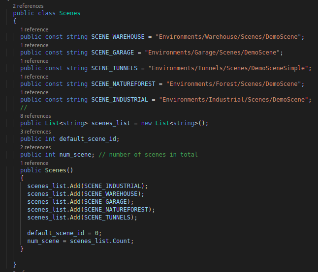

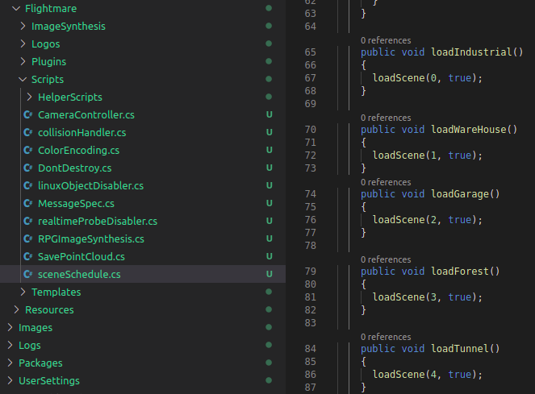

Add the scene to build settings
"""""""""""""""""""""""""""""""

The scene also needs to be added to the build settings. 
Either add the currently open scene or drag and drop the scene into the build settings. 
The index of the scene is important.

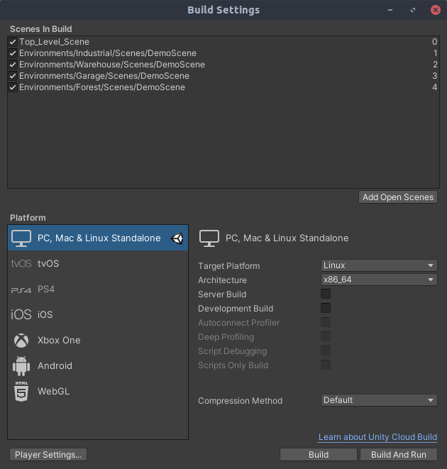

(Optional) Add button on the start menu for your scene
""""""""""""""""""""""""""""""""""""""""""""""""""""""

Optionally, we modify the splash screen by adding a button in the UI. 
We add the Load<Scene>() to the OnClick() function of the button.

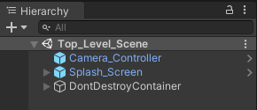

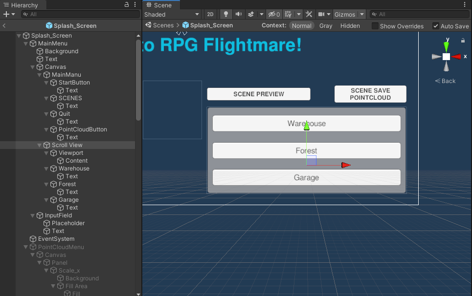

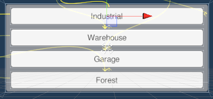

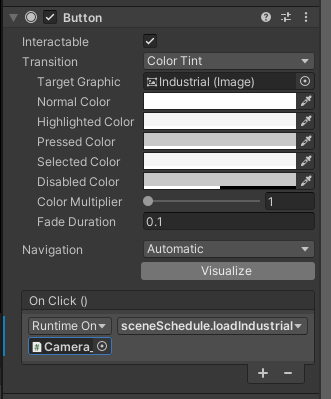

(Optional) Add a timeline for preview animation
""""""""""""""""""""""""""""""""""""""""""""""""

Optionally, we add a timeline to the scene. 
All timelines are saved in the *Environments/timelines* folder. 
For the timeline, the following steps need to be done:

* Add an HDCamera to the scene from *Flightmare/Templates/Camera/HDCamera.prefab*

* Record an animation for the camera

* Add an empty GameObject to the scene and add the timeline to it

* Add an animator to the HDCamera and select the camera by the GameObject with the timeline.

Add the scene to flightlib
""""""""""""""""""""""""""

To be able to launch the scene from the C++ client, you will need to add the scene to flightlib in the *flightlib/include/flightlib/bridges/unity_message_types.hpp*.

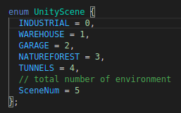